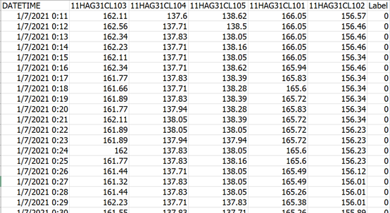
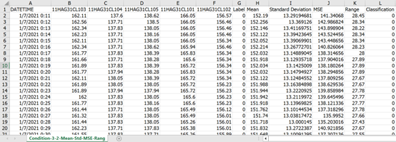
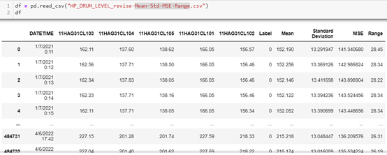
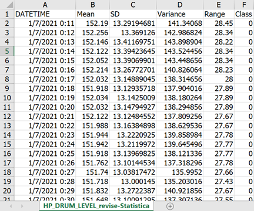
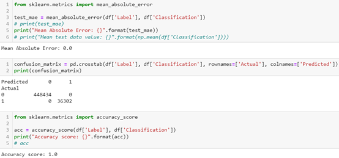
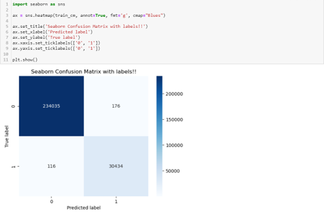
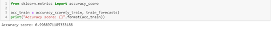
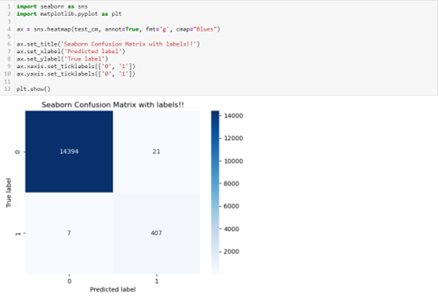
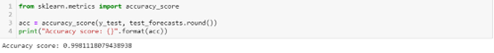

# 🤖 Development of Machine Learning Model for Error Detection of Multivariate Time Series Data

📌 Overview

This project focuses on the development of a machine learning model for anomaly (error) detection in multivariate time series data, based on real-world industrial datasets.

The objective is to design and improve detection methods by combining statistical feature engineering and machine learning techniques, and evaluating their performance using modern algorithms such as XGBoost.

This work was conducted as part of a Co-operative Education program under the Data Science team in the Cyber-Physical Systems (CPS) research group.

---

## 🎯 Objectives

Develop a model for detecting anomalies in multivariate time series data
Design new feature extraction and condition-based methods
Improve model performance compared to existing approaches
Apply machine learning models (especially XGBoost) for prediction tasks

---

## ✨ Core Features

- 📊 Multivariate Time Series Data Processing
- ⚙️ Feature Engineering (Mean, Std, Range, MSE, etc.)
- 🧠 Condition-based Classification Design
- 🚀 Machine Learning Model using XGBoost
- 📈 Model Evaluation (Accuracy, Confusion Matrix, MAE)
- 🔍 Error / Anomaly Detection System

---

## 🧠 Methodology

### 1️⃣ Data Preparation
Load and preprocess multivariate time series data
Clean and normalize datasets
Generate statistical features

### 2️⃣ Feature Engineering
Mean, Standard Deviation
Mean Squared Error (MSE)
Range and custom conditions
Create classification labels using defined rules

### 3️⃣ Model Development
Train model using XGBoost algorithm
Apply sliding window / time-based segmentation
Optimize hyperparameters

### 4️⃣ Evaluation
Confusion Matrix
Accuracy
Mean Absolute Error (MAE)
Prediction visualization

---

## 🏗️ Tech Stack
Programming Language
Python
Libraries & Tools
Pandas
NumPy
Scikit-learn
XGBoost
Matplotlib
Environment
Jupyter Notebook / Python Script

---

## 📸 Screenshots

### 🔐 Dataset Example


### 📩 Feature Engineering


### 🔄 Data Preparation


### 🏠 Model Output (CSV Result)


### 🏠 Model Evaluation


### 🏠 Confusion Matrix (Train)


### 🏠 Accuracy (Train)


### 🏠 Save Model (Train)


### 🏠 Confusion Matrix (Test)


### 🏠 Accuracy (Test)


---

## 📂 Project Structure

```plaintext
time-series-anomaly-detection/
│
├── data/                    # Dataset (CSV files)
├── models/                  # Trained models
├── notebooks/               # Jupyter notebooks
├── utils/                   # Helper functions (feature extraction, stats)
│
├── train.py                 # Model training script
├── predict.py               # Prediction script
├── requirements.txt         # Dependencies
│
└── README.md
```

---

## 📊 Results
The proposed model using XGBoost achieved satisfactory performance in detecting anomalies
Feature engineering significantly improved prediction accuracy
The model can be applied to real-world industrial datasets for error detection

---

## 🚀 Future Improvements

- 🔄 Real-time anomaly detection system
- 📊 Dashboard visualization (e.g., Streamlit / Web App)
- 🤖 Deep Learning models (LSTM, Transformer for time series)
- ⚡ Optimization for large-scale industrial data

---

## 👨‍🎓 Author

Tanatorn Pethmunee
Prince of Songkla University

---

## 📄 License

This project is for educational and research purposes
